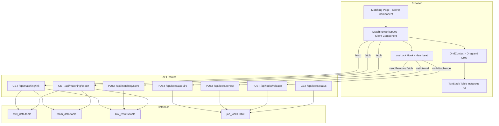
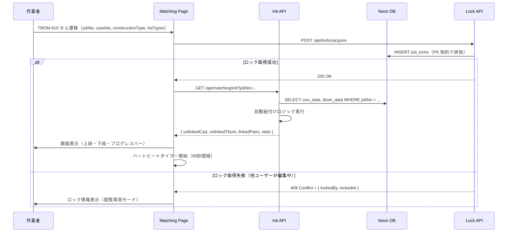
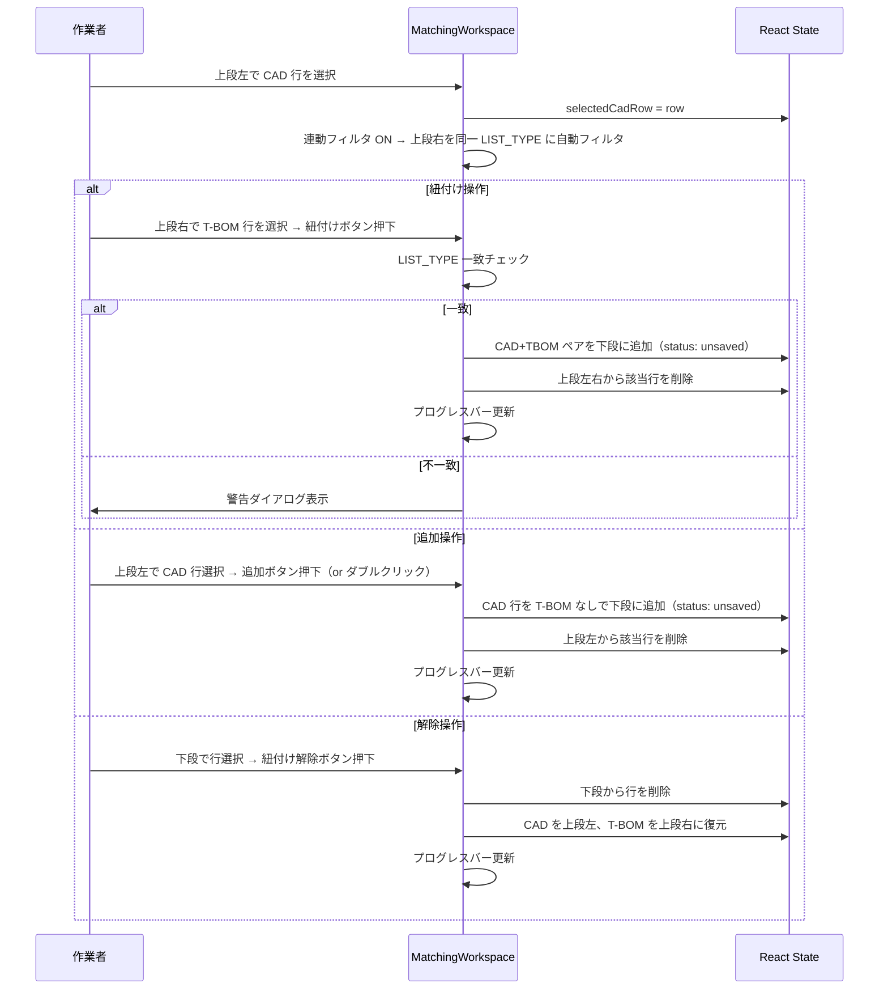
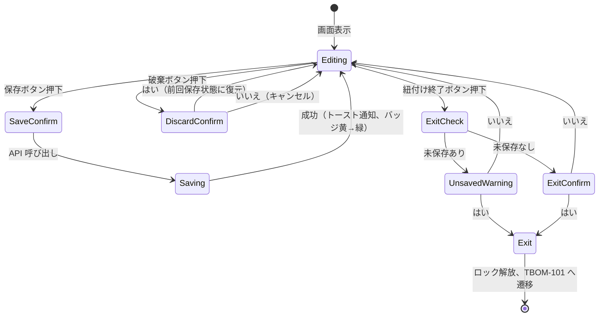
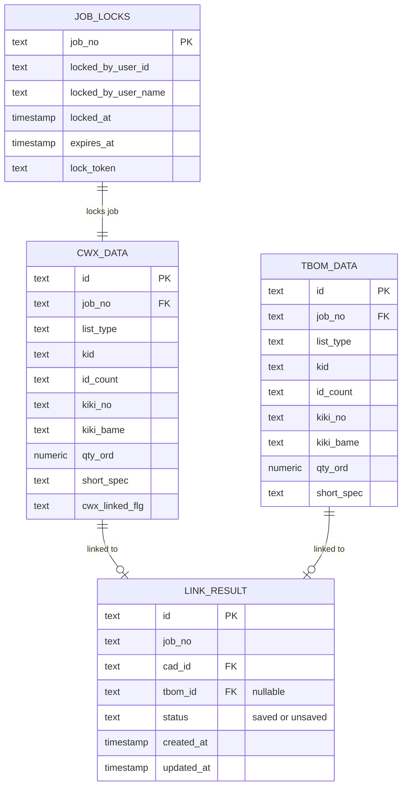

# Design Document — CADWorx 手動紐付け画面 (TBOM-611)

## Overview

**Purpose**: CADWorx（設計 CAD）の機器データと T-BOM（原価管理）の原価項目を突合・紐付けするための中核画面を提供する。自動紐付けで対応できなかった未紐付けデータを、作業者が視覚的に確認しながら手動で紐付け・追加・解除する。

**Users**: 水処理プラントのプロジェクト担当者（作業者）が、数百件の機器レコードの突合作業に使用する。

**Impact**: レガシーデスクトップアプリケーションの Web 移行版として、自動マッチング＋差分ハイライトで突合作業を大幅に効率化する。

### Goals

- CAD データと T-BOM データの5属性ミラー比較により、差異を一目で把握可能にする
- 自動紐付けロジックで手動作業の対象を最小限に絞り込む
- ボタン操作・ドラッグ&ドロップ・ダブルクリックの3方式で紐付け操作を提供する
- 工番単位の排他制御でデータ整合性を保証する
- 紐付け結果の Excel エクスポートを提供する

### Non-Goals

- TBOM-610（CADWorx P&ID 取込画面）の実装（遷移元として URL パラメータのみ連携）
- TBOM-101（メイン画面）の実装（遷移先として URL 遷移のみ）
- 機器分割処理、ブロックフローExcel取込、mdb書き戻し等の周辺機能
- ロール管理、監査ログ、詳細性能要件

---

## Architecture

> 詳細な調査ログは `research.md` を参照。

### Architecture Pattern & Boundary Map

Next.js App Router の Feature-Sliced パターンを採用する。`src/app/matching/` 配下にページ・コンポーネント・API を集約し、steering の規約に完全準拠する。



**Architecture Integration**:

- Selected pattern: Feature-Sliced (App Router 準拠) — 機能単位でコード分離し、steering の規約に合致
- Domain boundaries: データ取得・自動紐付けロジックは Server Component / API Route Handler 内、UI インタラクションは Client Component 内
- Existing patterns preserved: `getDb()` ファクトリ、`cn()` ユーティリティ、`@/` パスエイリアス、`env` オブジェクト経由の環境変数アクセス
- New components rationale: 紐付け画面固有のテーブル・操作・ロック機構は既存テンプレートに存在しないため新規作成
- Steering compliance: Server Component デフォルト、必要時のみ `"use client"`、Tailwind v4 + `cn()` スタイリング

### Technology Stack

| Layer          | Choice / Version                    | Role in Feature                                               | Notes                                          |
| -------------- | ----------------------------------- | ------------------------------------------------------------- | ---------------------------------------------- |
| Frontend       | React 19.2 + Next.js 16 App Router  | ページレンダリング、Client Component での UI インタラクション | steering 既定                                  |
| テーブル       | @tanstack/react-table v8            | ヘッドレステーブル（行選択・展開・フィルタ）                  | ~100 kB。Tailwind との親和性が最も高い         |
| DnD            | @dnd-kit/core + @dnd-kit/sortable   | テーブル間ドラッグ&ドロップ                                   | ~10 kB。React 19 対応実績最多                  |
| スタイリング   | Tailwind CSS v4                     | 全コンポーネントのスタイリング                                | steering 既定。カラーパレットを CSS 変数で定義 |
| Excel 出力     | exceljs v4.4                        | サーバーサイド .xlsx 生成                                     | サーバー専用。`writeBuffer()` でインメモリ生成 |
| Backend        | Next.js Route Handlers              | API エンドポイント（データ取得・保存・エクスポート・ロック）  | `getDb()` パターン準拠                         |
| Data           | Neon PostgreSQL + Drizzle ORM v0.45 | データ永続化・スキーマ管理                                    | steering 既定                                  |
| Infrastructure | Vercel (Serverless)                 | デプロイ・Cron Job（ロック GC）                               | steering 既定                                  |

> テーブルライブラリ・DnD ライブラリの選定根拠は `research.md` の Design Decisions セクションを参照。

---

## System Flows

### 画面初期化フロー



### 手動紐付け操作フロー



### 保存・終了フロー



---

## Requirements Traceability

| Requirement | Summary                                        | Components                          | Interfaces       | Flows      |
| ----------- | ---------------------------------------------- | ----------------------------------- | ---------------- | ---------- |
| 1.1         | TBOM-610 から遷移、パラメータ引き継ぎ          | MatchingPage                        | URL SearchParams | 画面初期化 |
| 1.2         | CWX/TBOM データ取得＋自動紐付け実行            | MatchingPage, AutoLinkEngine        | Init API         | 画面初期化 |
| 1.3         | ヘッダーに画面タイトル・工番等表示             | MatchingHeader                      | —                | —          |
| 1.4         | 紐付け進捗バー表示                             | ProgressBar                         | —                | —          |
| 2.1         | LIST_TYPE + KID でマッチング探索               | AutoLinkEngine                      | —                | 画面初期化 |
| 2.2         | ID_COUNT 完全一致 → 保存済み                   | AutoLinkEngine                      | —                | 画面初期化 |
| 2.3         | ID_COUNT 下5桁一致 → 未保存                    | AutoLinkEngine                      | —                | 画面初期化 |
| 2.4         | 不一致レコードを上段に残留                     | AutoLinkEngine                      | —                | 画面初期化 |
| 3.1         | CAD 未紐付け一覧（5属性）表示                  | CadUnlinkedTable                    | —                | —          |
| 3.2         | T-BOM 未紐付け一覧（5属性）表示                | TbomUnlinkedTable                   | —                | —          |
| 3.3         | 残件数リアルタイム表示                         | CadUnlinkedTable, TbomUnlinkedTable | —                | —          |
| 3.4         | 連動フィルタ（LIST_TYPE 自動フィルタ）         | TbomUnlinkedTable, useLinkedFilter  | —                | 手動紐付け |
| 3.5         | 選択行インライン展開                           | CadUnlinkedTable, TbomUnlinkedTable | —                | —          |
| 3.6         | リストタイプフィルタ（検索付きドロップダウン） | ListTypeFilter                      | —                | —          |
| 4.1         | 紐付けボタン操作                               | LinkActions, useMatchingState       | —                | 手動紐付け |
| 4.2         | 追加ボタン操作                                 | LinkActions, useMatchingState       | —                | 手動紐付け |
| 4.3         | 紐付け解除ボタン操作                           | LinkActions, useMatchingState       | —                | 手動紐付け |
| 4.4         | ドラッグ&ドロップ紐付け                        | DndLinkProvider                     | —                | 手動紐付け |
| 4.5         | ダブルクリック追加                             | CadUnlinkedTable                    | —                | 手動紐付け |
| 4.6         | 操作後のプログレスバー更新                     | ProgressBar, useMatchingState       | —                | 手動紐付け |
| 4.7         | LIST_TYPE 不一致警告                           | LinkActions                         | —                | 手動紐付け |
| 4.8         | 紐付け・追加ボタン無効化条件                   | LinkActions                         | —                | —          |
| 4.9         | 紐付け解除ボタン無効化条件                     | LinkActions                         | —                | —          |
| 5.1         | 下段ミラーテーブル表示                         | LinkedMirrorTable                   | —                | —          |
| 5.2         | 差異セルのオレンジハイライト                   | LinkedMirrorTable                   | —                | —          |
| 5.3         | T-BOM 対応なし行のグレーアウト                 | LinkedMirrorTable                   | —                | —          |
| 5.4         | ステータスバッジ表示                           | StatusBadge                         | —                | —          |
| 5.5         | 下段リストタイプフィルタ                       | ListTypeFilter                      | —                | —          |
| 5.6         | 下段ステータスフィルタ                         | StatusFilter                        | —                | —          |
| 5.7         | テキスト検索（インクリメンタルサーチ）         | LinkedMirrorTable                   | —                | —          |
| 5.8         | 下段ソート順（LIST_TYPE → KID 昇順）           | LinkedMirrorTable                   | —                | —          |
| 6.1         | 保存（未保存 → DB 反映、バッジ更新、トースト） | FooterActions                       | Save API         | 保存・終了 |
| 6.2         | 破棄確認ダイアログ                             | FooterActions                       | —                | 保存・終了 |
| 6.3         | 破棄実行（前回保存状態に復元）                 | FooterActions, useMatchingState     | —                | 保存・終了 |
| 6.4         | 終了確認（未保存あり）                         | FooterActions                       | —                | 保存・終了 |
| 6.5         | 終了確認（未保存なし）                         | FooterActions                       | —                | 保存・終了 |
| 6.6         | 終了実行（ロック解放、遷移）                   | FooterActions, useLock              | Lock Release API | 保存・終了 |
| 7.1         | Excel 出力                                     | FooterActions                       | Export API       | —          |
| 8.1         | ロック取得（画面表示時）                       | useLock                             | Lock Acquire API | 画面初期化 |
| 8.2         | ロック情報表示（他ユーザー編集中）             | LockBanner                          | Lock Status API  | 画面初期化 |
| 8.3         | ロック自動解放                                 | useLock                             | Lock Release API | 保存・終了 |
| 9.1-9.6     | プログレスバー（表示・計算・色・更新）         | ProgressBar                         | —                | —          |
| 10.1-10.3   | レスポンシブ対応                               | MatchingWorkspace                   | —                | —          |
| 11.1-11.3   | カラーパレット・視覚ルール                     | 全テーブルコンポーネント            | —                | —          |

---

## Components and Interfaces

| Component         | Domain/Layer | Intent                                                 | Req Coverage            | Key Dependencies                          | Contracts |
| ----------------- | ------------ | ------------------------------------------------------ | ----------------------- | ----------------------------------------- | --------- |
| MatchingPage      | Page         | 画面エントリポイント（Server Component）               | 1.1, 1.2                | Init API (P0)                             | API       |
| MatchingHeader    | UI           | ヘッダー（タイトル・工番情報・プログレスバー）         | 1.3, 1.4, 9.1-9.6       | useMatchingState (P0)                     | State     |
| MatchingWorkspace | UI           | Client Component ルート。全 UI インタラクション管理    | 全要件                  | DndContext (P0), useMatchingState (P0)    | State     |
| CadUnlinkedTable  | UI           | 上段左 CAD 未紐付けテーブル                            | 3.1, 3.3, 3.5, 3.6, 4.5 | TanStack Table (P0), @dnd-kit (P1)        | State     |
| TbomUnlinkedTable | UI           | 上段右 T-BOM 未紐付けテーブル                          | 3.2, 3.3, 3.4, 3.5      | TanStack Table (P0), useLinkedFilter (P0) | State     |
| LinkedMirrorTable | UI           | 下段紐付け済みミラー比較テーブル                       | 5.1-5.8                 | TanStack Table (P0)                       | State     |
| LinkActions       | UI           | 紐付け・追加・解除ボタン群                             | 4.1-4.3, 4.7-4.9        | useMatchingState (P0)                     | —         |
| DndLinkProvider   | UI           | DnD コンテキストラッパー                               | 4.4                     | @dnd-kit/core (P0)                        | —         |
| FooterActions     | UI           | フッターアクションバー                                 | 6.1-6.6, 7.1            | Save API (P0), Export API (P1)            | API       |
| AutoLinkEngine    | Logic        | 自動紐付けロジック（サーバーサイド）                   | 2.1-2.4                 | —                                         | Service   |
| useMatchingState  | Hook         | 紐付け状態管理（上段・下段データ、選択状態、フィルタ） | 全要件                  | —                                         | State     |
| useLock           | Hook         | 排他制御（取得・ハートビート・解放）                   | 8.1-8.3                 | Lock APIs (P0)                            | API       |
| ListTypeFilter    | UI           | 検索付きドロップダウンフィルタ                         | 3.6, 5.5                | —                                         | —         |
| StatusFilter      | UI           | ステータスフィルタ                                     | 5.6                     | —                                         | —         |
| StatusBadge       | UI           | ステータスバッジ（未保存/保存済み）                    | 5.4                     | —                                         | —         |
| ProgressBar       | UI           | 紐付け進捗バー                                         | 9.1-9.6                 | useMatchingState (P0)                     | —         |
| LockBanner        | UI           | ロック情報バナー（閲覧専用モード）                     | 8.2                     | —                                         | —         |

### Logic Layer

#### AutoLinkEngine

| Field        | Detail                                                                                          |
| ------------ | ----------------------------------------------------------------------------------------------- |
| Intent       | CAD レコードを起点に LIST_TYPE + KID + ID_COUNT ルールで T-BOM レコードとの自動紐付けを実行する |
| Requirements | 2.1, 2.2, 2.3, 2.4                                                                              |

**Responsibilities & Constraints**

- CAD データを起点にした単方向マッチング（CAD → T-BOM）
- LIST_TYPE 一致を前提条件とし、KID + ID_COUNT で状態判定
- 純粋関数として実装（副作用なし、DB アクセスなし）

**Dependencies**

- Inbound: Init API — CAD/TBOM 生データを受け取る (P0)

**Contracts**: Service [x]

##### Service Interface

```typescript
interface AutoLinkResult {
  linkedPairs: LinkedPair[];
  unlinkedCad: CwxRecord[];
  unlinkedTbom: TbomRecord[];
}

interface LinkedPair {
  cad: CwxRecord;
  tbom: TbomRecord | null; // null = T-BOM 対応なし（追加）
  status: "saved" | "unsaved";
}

function executeAutoLink(cadRecords: CwxRecord[], tbomRecords: TbomRecord[]): AutoLinkResult;
```

- Preconditions: cadRecords と tbomRecords は同一工番のデータ
- Postconditions: すべての CAD レコードが linkedPairs または unlinkedCad のいずれかに振り分けられる。T-BOM レコードも linkedPairs または unlinkedTbom に振り分けられる
- Invariants: linkedPairs 内の各ペアは LIST_TYPE が一致する

### Hooks Layer

#### useMatchingState

| Field        | Detail                                     |
| ------------ | ------------------------------------------ |
| Intent       | 紐付け画面の全状態を管理するカスタムフック |
| Requirements | 全要件（状態管理の中核）                   |

**Responsibilities & Constraints**

- 上段左（CAD 未紐付け）、上段右（T-BOM 未紐付け）、下段（紐付け済みペア）の3つのデータ配列を管理
- 選択状態、フィルタ状態、前回保存スナップショットを保持
- 紐付け・追加・解除操作の実行と進捗率の計算

**Contracts**: State [x]

##### State Management

```typescript
interface MatchingState {
  // データ
  unlinkedCad: CwxRecord[];
  unlinkedTbom: TbomRecord[];
  linkedPairs: LinkedPair[];

  // 選択
  selectedCadRow: CwxRecord | null;
  selectedTbomRow: TbomRecord | null;
  selectedLinkedRow: LinkedPair | null;

  // フィルタ
  cadListTypeFilter: string | null; // null = 全て
  linkedListTypeFilter: string | null;
  linkedStatusFilter: "all" | "unsaved" | "saved";
  linkedSearchText: string;
  isLinkedFilterEnabled: boolean; // 連動フィルタ ON/OFF

  // 進捗
  totalCadCount: number;
  linkedCount: number; // linkedPairs.length
  progressPercent: number;

  // スナップショット（破棄用）
  lastSavedSnapshot: MatchingStateSnapshot | null;
  hasUnsavedChanges: boolean;
}

interface MatchingActions {
  linkPair(cadRow: CwxRecord, tbomRow: TbomRecord): LinkResult;
  addWithoutTbom(cadRow: CwxRecord): void;
  unlinkPair(pair: LinkedPair): void;
  selectCadRow(row: CwxRecord | null): void;
  selectTbomRow(row: TbomRecord | null): void;
  selectLinkedRow(pair: LinkedPair | null): void;
  setCadListTypeFilter(listType: string | null): void;
  setLinkedListTypeFilter(listType: string | null): void;
  setLinkedStatusFilter(filter: "all" | "unsaved" | "saved"): void;
  setLinkedSearchText(text: string): void;
  toggleLinkedFilter(enabled: boolean): void;
  markAsSaved(): void;
  discardChanges(): void;
}

type LinkResult = { success: true } | { success: false; reason: "list_type_mismatch" };
```

#### useLock

| Field        | Detail                                     |
| ------------ | ------------------------------------------ |
| Intent       | 工番単位の排他制御を管理するカスタムフック |
| Requirements | 8.1, 8.2, 8.3                              |

**Responsibilities & Constraints**

- 画面マウント時にロック取得を試行
- 60秒間隔のハートビートでロックを更新
- `visibilitychange` / `pagehide` でロック解放
- ハートビート失敗時にコールバックでユーザーに通知

**Contracts**: API [x]

```typescript
interface UseLockOptions {
  jobNo: string;
  userId: string;
  userName: string;
  onLockLost?: () => void;
}

interface UseLockReturn {
  isLocked: boolean;
  lockInfo: { lockedBy: string; lockedAt: Date } | null;
  acquire: () => Promise<boolean>;
  release: () => Promise<void>;
}

function useLock(options: UseLockOptions): UseLockReturn;
```

### API Layer

#### Init API

| Field        | Detail                                                               |
| ------------ | -------------------------------------------------------------------- |
| Intent       | 工番に紐づく CWX/TBOM データを取得し、自動紐付けを実行して結果を返す |
| Requirements | 1.1, 1.2, 2.1-2.4                                                    |

**Dependencies**

- Outbound: Neon DB — CWX_DATA, TBOM_DATA テーブル (P0)
- Internal: AutoLinkEngine — 自動紐付け実行 (P0)

**Contracts**: API [x]

##### API Contract

| Method | Endpoint           | Request                                              | Response     | Errors        |
| ------ | ------------------ | ---------------------------------------------------- | ------------ | ------------- |
| GET    | /api/matching/init | `?jobNo=X&caseNo=Y&constructionType=Z&listTypes=A,B` | InitResponse | 400, 404, 500 |

```typescript
interface InitResponse {
  header: {
    jobNo: string;
    caseNo: string;
    constructionType: string;
    screenTitle: string;
  };
  unlinkedCad: CwxRecord[];
  unlinkedTbom: TbomRecord[];
  linkedPairs: LinkedPair[];
  stats: {
    totalCadCount: number;
    linkedCount: number;
  };
}
```

#### Save API

| Field        | Detail                             |
| ------------ | ---------------------------------- |
| Intent       | 未保存の紐付け結果を DB に反映する |
| Requirements | 6.1                                |

**Contracts**: API [x]

##### API Contract

| Method | Endpoint           | Request     | Response     | Errors        |
| ------ | ------------------ | ----------- | ------------ | ------------- |
| POST   | /api/matching/save | SaveRequest | SaveResponse | 400, 409, 500 |

```typescript
interface SaveRequest {
  jobNo: string;
  lockToken: string;
  pairs: Array<{
    cadId: string;
    tbomId: string | null;
    status: "unsaved";
  }>;
}

interface SaveResponse {
  savedCount: number;
}
```

#### Export API

| Field        | Detail                                                                |
| ------------ | --------------------------------------------------------------------- |
| Intent       | 下段ミラーテーブルの内容を Excel ファイルとして生成しダウンロードする |
| Requirements | 7.1                                                                   |

**Dependencies**

- External: exceljs — Excel ファイル生成 (P0)
- Outbound: Neon DB — link_results, cwx_data, tbom_data (P0)

**Contracts**: API [x]

##### API Contract

| Method | Endpoint             | Request    | Response       | Errors   |
| ------ | -------------------- | ---------- | -------------- | -------- |
| GET    | /api/matching/export | `?jobNo=X` | Binary (.xlsx) | 400, 500 |

**Implementation Notes**

- exceljs `writeBuffer()` でインメモリ生成。ファイルシステムアクセス不要
- ヘッダー行: 青背景 (#1976D2) + 白文字、CAD 側ラベル: 濃青 (#1565C0)、T-BOM 側ラベル: 濃ティール (#00695C)
- 差異セル: オレンジ背景 (#FFA500)、T-BOM 対応なし: グレー背景 (#E0E0E0)
- `Content-Disposition: attachment; filename="matching-result-{jobNo}.xlsx"`
- Turbopack 互換のため `serverExternalPackages: ['exceljs']` 設定が必要な場合あり（`research.md` 参照）

#### Lock APIs

| Field        | Detail                              |
| ------------ | ----------------------------------- |
| Intent       | 工番単位の排他制御を API で管理する |
| Requirements | 8.1, 8.2, 8.3                       |

**Contracts**: API [x]

##### API Contract

| Method | Endpoint                  | Request                                  | Response                           | Errors               |
| ------ | ------------------------- | ---------------------------------------- | ---------------------------------- | -------------------- |
| POST   | /api/locks/acquire        | `{ jobNo, userId, userName, lockToken }` | `{ success: true }`                | 409 (locked)         |
| POST   | /api/locks/renew          | `{ jobNo, lockToken }`                   | `{ success: true }`                | 409 (token mismatch) |
| POST   | /api/locks/release        | `{ jobNo, lockToken }`                   | `{ success: true }`                | —                    |
| GET    | /api/locks/status/[jobNo] | —                                        | `{ locked, lockedBy?, lockedAt? }` | —                    |

**Implementation Notes**

- ロック取得: 失効ロック削除 → INSERT（PK 制約で排他保証）→ 失敗時は 409 + ロック者情報
- ロック更新: lockToken 一致時のみ expiresAt を延長（TTL 120秒）
- ロック解放: lockToken 一致時のみ DELETE
- 失効ロック GC: Vercel Cron Job（`/api/cron/cleanup-locks`）で定期削除
- `navigator.sendBeacon` + `keepalive: true` fetch のフォールバックでページ終了時の確実な解放を試行

---

## Data Models

### Domain Model



**Aggregates and Boundaries**:

- `CWX_DATA` / `TBOM_DATA`: 読み取り専用のソースデータ。紐付け画面からは参照のみ
- `LINK_RESULT`: 紐付け結果の永続化。CAD と T-BOM の紐付け関係を管理
- `JOB_LOCKS`: 排他制御用。工番単位でのロック管理

**Business Rules & Invariants**:

- 同一 LIST_TYPE 間のみ紐付け可能
- 1つの CAD レコードは最大1つの T-BOM レコードと紐付く（1:0..1）
- 1つの T-BOM レコードは最大1つの CAD レコードと紐付く（0..1:1）

### Physical Data Model

#### `cwx_data` テーブル

```typescript
export const cwxData = pgTable(
  "cwx_data",
  {
    id: text("id").primaryKey(),
    jobNo: text("job_no").notNull(),
    listType: text("list_type").notNull(),
    kid: text("kid").notNull(),
    idCount: text("id_count").notNull(),
    kikiNo: text("kiki_no").notNull(),
    kikiBame: text("kiki_bame").notNull(),
    qtyOrd: text("qty_ord").notNull(),
    shortSpec: text("short_spec"),
    cwxLinkedFlg: text("cwx_linked_flg"),
  },
  (table) => [
    index("cwx_data_job_no_idx").on(table.jobNo),
    index("cwx_data_job_list_type_idx").on(table.jobNo, table.listType),
  ],
);
```

#### `tbom_data` テーブル

```typescript
export const tbomData = pgTable(
  "tbom_data",
  {
    id: text("id").primaryKey(),
    jobNo: text("job_no").notNull(),
    listType: text("list_type").notNull(),
    kid: text("kid").notNull(),
    idCount: text("id_count").notNull(),
    kikiNo: text("kiki_no").notNull(),
    kikiBame: text("kiki_bame").notNull(),
    qtyOrd: text("qty_ord").notNull(),
    shortSpec: text("short_spec"),
  },
  (table) => [
    index("tbom_data_job_no_idx").on(table.jobNo),
    index("tbom_data_job_list_type_idx").on(table.jobNo, table.listType),
  ],
);
```

#### `link_results` テーブル

```typescript
export const linkResults = pgTable(
  "link_results",
  {
    id: text("id").primaryKey(),
    jobNo: text("job_no").notNull(),
    cadId: text("cad_id")
      .notNull()
      .references(() => cwxData.id),
    tbomId: text("tbom_id").references(() => tbomData.id), // nullable
    status: text("status", { enum: ["saved", "unsaved"] }).notNull(),
    createdAt: timestamp("created_at").defaultNow().notNull(),
    updatedAt: timestamp("updated_at").defaultNow().notNull(),
  },
  (table) => [
    index("link_results_job_no_idx").on(table.jobNo),
    index("link_results_cad_id_idx").on(table.cadId),
  ],
);
```

#### `job_locks` テーブル

```typescript
export const jobLocks = pgTable(
  "job_locks",
  {
    jobNo: text("job_no").primaryKey(),
    lockedByUserId: text("locked_by_user_id").notNull(),
    lockedByUserName: text("locked_by_user_name").notNull(),
    lockedAt: timestamp("locked_at", { withTimezone: true }).defaultNow().notNull(),
    expiresAt: timestamp("expires_at", { withTimezone: true }).notNull(),
    lockToken: text("lock_token").notNull(),
  },
  (table) => [index("job_locks_expires_at_idx").on(table.expiresAt)],
);
```

### Data Contracts & Integration

**API Data Transfer — 共通レコード型**

```typescript
interface CwxRecord {
  id: string;
  jobNo: string;
  listType: string;
  kid: string;
  idCount: string;
  kikiNo: string;
  kikiBame: string;
  qtyOrd: string;
  shortSpec: string | null;
  cwxLinkedFlg: string | null;
}

interface TbomRecord {
  id: string;
  jobNo: string;
  listType: string;
  kid: string;
  idCount: string;
  kikiNo: string;
  kikiBame: string;
  qtyOrd: string;
  shortSpec: string | null;
}

interface LinkedPair {
  id: string;
  cad: CwxRecord;
  tbom: TbomRecord | null;
  status: "saved" | "unsaved";
}
```

---

## Error Handling

### Error Strategy

ユーザーエラーはインライン警告・ダイアログで即座にフィードバックする。システムエラーはトースト通知で報告し、操作のリトライを可能にする。

### Error Categories and Responses

**User Errors (4xx)**:

- LIST_TYPE 不一致紐付け → 警告ダイアログ（MSG-01: 「リストタイプが一致しません。同一リストタイプの機器のみ紐付けできます。」）
- 未選択状態でのボタン押下 → ボタン無効化で予防

**System Errors (5xx)**:

- Init API 失敗 → エラー画面表示 + リトライボタン
- Save API 失敗 → トースト通知「保存に失敗しました。再度お試しください。」
- Export API 失敗 → トースト通知「Excel 出力に失敗しました。」

**Business Logic Errors (409)**:

- ロック競合 → ロック情報バナー表示（ロック者名 + 開始時刻）、編集操作を無効化
- ロック失効（ハートビート失敗） → 警告バナー「サーバーとの接続が切れました。作業内容を保存してください。」

### Monitoring

- API Route Handler でのエラーログ出力（`console.error` → Vercel Logs）
- ロック失効イベントのクライアント側トラッキング

---

## Testing Strategy

### Unit Tests

- AutoLinkEngine: ID_COUNT 完全一致・下5桁一致・不一致の各パターン（5ケース以上）
- useMatchingState: 紐付け・追加・解除・破棄・フィルタの状態遷移
- ProgressBar: 進捗率計算と色判定（0-49%, 50-89%, 90-100%）
- LIST_TYPE 不一致バリデーション

### Integration Tests

- Init API: CWX/TBOM データ取得 + 自動紐付け結果の正確性
- Save API: 未保存ペアの DB 反映とステータス更新
- Lock APIs: 取得・更新・解放・競合の各シナリオ
- Export API: Excel ファイル生成（ヘッダー色・差異ハイライト・ダウンロードレスポンス）

### E2E Tests

- 画面初期表示: パラメータ引き継ぎ、自動紐付け結果の振り分け表示
- 手動紐付けフロー: CAD 選択 → T-BOM 選択 → 紐付け → 下段表示 → 差異ハイライト確認
- 保存・破棄・終了: 各ダイアログ表示と状態遷移
- 連動フィルタ: CAD 行選択時の T-BOM 自動フィルタ動作
- 排他制御: 2ブラウザでの同一工番アクセス時のロック表示

---

## Optional Sections

### Security Considerations

- ロック操作は `lockToken` で認証し、他タブ・他ユーザーからの不正操作を防止
- Save API は `lockToken` 検証を含み、ロック未保持時の保存を拒否
- Excel 出力 API はサーバーサイド生成のみ。クライアントにデータ加工を委譲しない
- URL パラメータ（jobNo 等）のバリデーションを Zod で実施

### Performance & Scalability

- Target: 500 行/テーブルでフィルタ反映 200ms 以内
- 初回データ取得: サーバーサイドで自動紐付け実行後にクライアントへ転送（1回の API コール）
- クライアントサイドフィルタ: TanStack Table の組み込みフィルタで DOM 再レンダリングのみ（API 不要）
- 仮想化は初回リリース後のプロファイリング結果に基づいて判断（`research.md` 参照）
